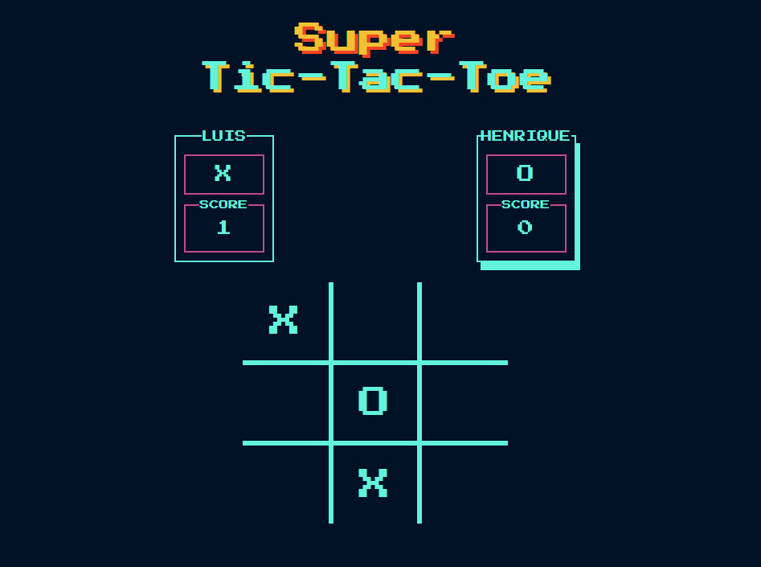

# Javasript - Tic-Tac-Toe
  
## About
This project is part of the Microverse Curriculum projects. It is a Javascript application to practice factory functions and modules. 
This is a tic-tac-toe game for two players with retro style.

## How to play
* You must input the names of the players before start the game.
* First player has to choose a cell to put his token.
* We keep scores of the game result.
* After every game, you can choose to play a new game or reset it.

## Project specifications
* [The Odin Project Tic-Tac-Toe](https://www.theodinproject.com/courses/javascript/lessons/tic-tac-toe-javascript)

## Build with
* JavaScript
* HTML
* CSS
* Jest for testing
* [Bootstrap](https://getbootstrap.com/)

## Live Version
Check the live version [here](https://rawcdn.githack.com/nriqu322/JS-Tic-Tac-Toe/673a24ceea386eac2bbb48b592fef4105fe0020d/dist/index.html).

## Future Features
* Play against the computer.

## Author

👤 **Luis Saavedra**
- Github: [@nriqu322](https://github.com/nriqu322)
- Twitter: [@nriqu322](https://twitter.com/nriqu322)
- Linkedin: [Luis Saavedra](https://linkedin.com/in/luis-saavedra-sanchez/)

---

## 🤝 Contributing

Contributions, issues and feature requests are welcome!

Feel free to check the [issues page](issues/).

## Show your support

Give a ⭐️ if you like this project!

## Acknowledgments

[Microverse](https://microverse.org)

---

## 📝 License

This project is [MIT](/LICENSE) licensed.

---